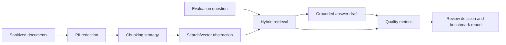

# Architecture Overview

This repository demonstrates a local, sanitized RAG quality lab for evaluating retrieval and answer grounding.

## Quality Dimensions

- Retrieval recall and precision.
- Context relevance and redundancy.
- Citation coverage.
- Groundedness and unsupported-claim detection.
- Low-confidence routing for human review.

## Production Extension Points

- Azure AI Search for hybrid retrieval.
- PostgreSQL/pgvector or another vector store behind the same interface.
- Reranking with a cross-encoder or provider-native reranker.
- Offline benchmark suites for prompt and retrieval regression checks.
- Feedback loop from reviewer corrections into evaluation data.
